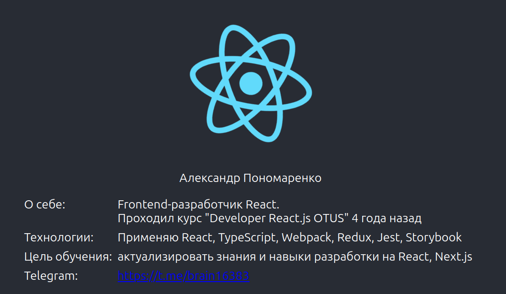

# Деплой и знакомство

## Цель
* форкнуть и задеплоить репозиторий в котором необходимо написать о себе;

* склонировать и запустить учебный репозиторий.

## Выполнение д/з
1. Выполнен форк репозитория https://github.com/React-js-OTUS/react-start-template

2. Новому репозиторию присвоено имя reactjs-profile
https://github.com/alexanderpono/reactjs-profile

3. Репозиторий клонирован на локальный компьютер
4. В репозитории создана ветка gh-pages
5. Настроен деплой репозитория из ветки gh-pages на сервер Github Pages
6. В проекте создана ветка "feature/lesson02-react-hw":
https://github.com/alexanderpono/reactjs-profile/tree/feature/lesson02-react-hw

7. В ветку добавлены коммиты: 

* "feat: add gh-pages" (настроен ручной деплой на github - команда "npm run deploy") https://github.com/alexanderpono/reactjs-profile/pull/1/commits/edc39e2f6861d25a4958bdbe5a55584a358b0a31

* "feat: add profile text" (добавлена информация профиля) https://github.com/alexanderpono/reactjs-profile/pull/1/commits/1f162829c6f6d53f2b18656b8cc0adec70a087d9

8. На локальном компьютеры выполнены команды:
```
npm ci
npm run build
npm run deploy
```

9. Откомпилированный локально статический сайт задеплоен и доступен по адресу:
https://alexanderpono.github.io/reactjs-profile/


10. Открыт PR с доработками данного урока 
https://github.com/alexanderpono/reactjs-profile/pull/1

    Мерж в ветку main пока не выполнен, поэтому автодеплой не запущен. Деплой выполнен при помощи команды "npm run deploy"

11. Скриншот профиля
